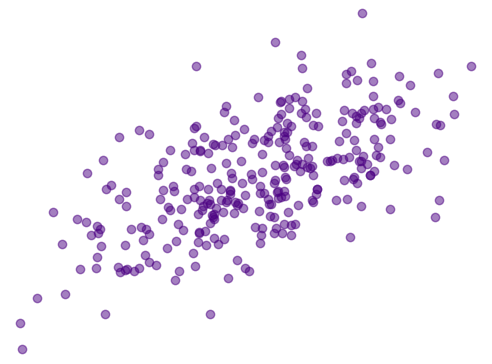

# Learning Linear Regression

A compilation of knowledge about Linear Regression models using synthetic data.

### Questions I aim to answer

(can also be found at [the bottom of the notebook](./linear-regression.ipynb))

* [ ] What is Linear Regression?
* [ ] How can I interpret this kind of model?
* [ ] What kind of problem it can solve?
* [ ] What type of data do we need?

## References

* Life with data | How to create a baseline regression model - ([link](https://lifewithdata.com/2022/03/22/how-to-create-a-baseline-regression-model-in-scikit-learn/))

* Sci-kit learn documentation | LinearRegression - ([link](https://scikit-learn.org/stable/modules/generated/sklearn.linear_model.LinearRegression.html))

* Sci-kit learn documentation | train_test_split - ([link](https://scikit-learn.org/stable/modules/generated/sklearn.model_selection.train_test_split.html))

* scribbr: Simple Linear Regression | An Easy Introduction & Examples - ([link](https://www.scribbr.com/statistics/simple-linear-regression/))

* scribbr: Multiple Linear Regression | A Quick Guide (Examples) - ([link](https://www.scribbr.com/statistics/multiple-linear-regression/))

* Statistics easily | Linear regression with sci-kit learn - ([link](https://statisticseasily.com/linear-regression-with-scikit-learn/))

* Investopedia | r-squared - ([link](https://www.investopedia.com/terms/r/r-squared.asp))

* Stephen Allwright | interpret mse - ([link](https://stephenallwright.com/interpret-mse/))
